- [Plugin Watchdog](#plugin-watchdog)
- [Installer le Plugin Watchdog](#installer-le-plugin-watchdog)
- [Configurer le plugin](#configurer-le-plugin)
- [Configurer le Watchdog](#configurer-le-watchdog)
  - [Onglet Watchdog](#onglet-watchdog)
  - [Onglet Contrôles](#onglet-contrôles)
  - [Onglet Actions](#onglet-actions)
- [Widgets](#widgets)
- [Exemples d’utilisation des Watchdogs](#exemples-dutilisation-des-watchdogs)
  - [Contrôler les équipements du réseau local](#contrôler-les-équipements-du-réseau-local)
    - [Onglet Watchdog](#onglet-watchdog-1)
    - [Onglet Contrôles](#onglet-contrôles-1)
    - [Onglet Actions](#onglet-actions-1)
  - [Relancer le routeur Zigbee si il ne répond pas](#relancer-le-routeur-zigbee-si-il-ne-répond-pas)
    - [Onglet Watchdog](#onglet-watchdog-2)
    - [Onglet Contrôles](#onglet-contrôles-2)
    - [Onglet Actions](#onglet-actions-2)
  - [Contrôler que les Nuts sont vivants](#contrôler-que-les-nuts-sont-vivants)
    - [Onglet Watchdog](#onglet-watchdog-3)
    - [Onglet Contrôles](#onglet-contrôles-3)
    - [Onglet Actions](#onglet-actions-3)
  - [Contrôler que les capteurs XIAOMI sont actifs](#contrôler-que-les-capteurs-xiaomi-sont-actifs)
    - [Onglet Watchdog](#onglet-watchdog-4)
    - [Onglet Contrôles](#onglet-contrôles-4)
    - [Onglet Actions](#onglet-actions-4)
- [Avis](#avis)

# Plugin Watchdog

La fonction principale du plugin watchdog est de surveiller les équipements et d'avertir l'administrateur des éventuels problèmes. L'utilisation généralisée du plugin permet de fiabiliser son installation Jeedom et de se montrer proactif dans la détection et résolution des problèmes courants.

Exemples typiques d'utilisation :

*   **Contrôler que les capteurs sont bien actifs**
*   **S’assurer que les équipements réseau sont bien connectés au routeur**
*   **Vérifier que les nuts sont toujours actifs**  

Les contrôles peuvent être programmés sur le modèle de planification des crons.

En fonction du résultat des contrôles, des actions peuvent être lancées, typiquement envoi de messages / mails ou relance d'équipements.

Le résultat des contrôles peut être centralisé dans un équipement virtuel afin d'avoir une vision immédiate des éventuels problèmes.

Le plugin reprend une grosse partie des fonctions trouvées dans les scénarios au niveau des contrôles et des actions. Il se montre bien plus facile à mettre en oeuvre que les scénarios.

Le plugin est autodocumenté: les explications sont fournies au niveau de la configuration du plugin et des watchdogs. Dans cette documentation, on ne reprend pas forcément toutes les explications fournies sur l'interface utilisateur.  

# Installer le Plugin Watchdog

Aller dans le Market, trouver le plugin watchdog et installer la version **stable**. Puis **Activer le plugin**.

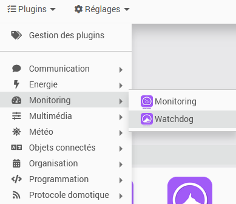

Le plugin est accessible via le menu.

# Configurer le plugin

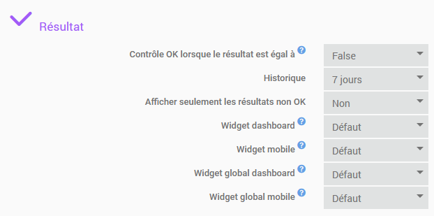

Cette section définit le paramètrage par défaut pour le résultat des contrôles (expliqué par la suite).

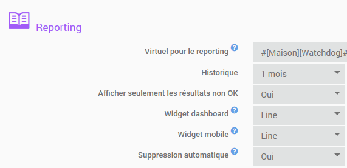

Cette section définit le paramètrage par défaut pour l'enregistrement du résultat des conditions dans un virtuel (expliqué par la suite).

Comme pour tout plugin, vous pouvez activer le mode debug pour suivre le détail des contrôles et actions.

# Configurer le Watchdog

La configuration d'un watchdog passe par 3 onglets:

* Watchdog: onglet général où sont définies les caractéristiques et le fonctionnement du watchdog
* Contrôles: onglet où sont définis les tests à effectuer
* Actions: onglet où sont définies les actions à mener en fonction du résultat des tests

## Onglet Watchdog

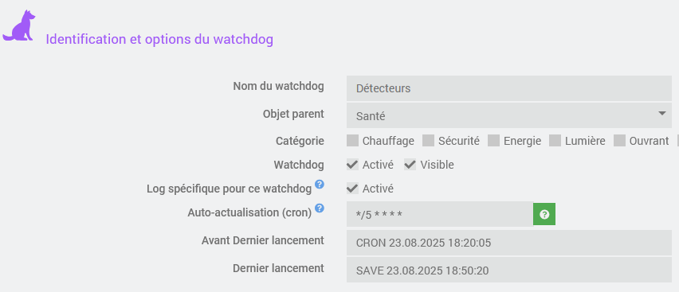

On trouve les champs habituels des équipements Jeedom (nom, objet, ...)..

Il est possible de spécifier une log spécifique pour le watchdog ce qui permet un suivi plus facile de son activité. En cliquant sur le bouton log en haut de l'écran, vous pouvez accéder directement à la visualisation de la log.

La fréquence de lancement du watchdog est définie dans le paramètrage du cron et peut-être déterminée à l'aide de l'assistant.

Les dates des deux derniers lancements et leur mode de lancement sont affichée.

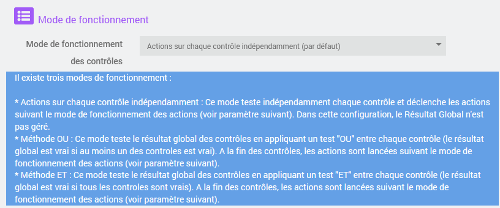

Le mode de fonctionnement des contrôles est un paramètre important car il détermine comment le watchdog va se comporter vis à vis des contrôles et des actions.

Trois modes sont possibles:

*   Actions sur chaque contrôle indépendamment : ce mode teste indépendamment chaque contrôle et déclenche les actions quand ce contrôle a changé d’état
*   Actions sur l’ensemble des contrôles (avec méthode OU) : Ce mode exécute tous les contrôles et détermine le résultat global en appliquant la condition OU (le résultat global est True si au moins l'une des conditions vaut True). Il déclenche les actions quand le résultat global a changé d’état.
*   Actions sur l’ensemble des contrôles (avec méthode ET) : Ce mode est le même que le précédent mais en appliquant la condition ET (le résultat global est vrai si toutes les conditions sont égales à True).

Avec les améliorations qui ont été apportées dans le paramétrage des actions, le premier mode doit permettre de traiter la gande majorité des situations.

Le mode de fonctionnement des actions détermine dans quel cas les actions sont déclenchées.

Deux modes sont possibles:

*   Lancer les actions uniquement si le contrôle (ou résultat global dans le mode OU/ET) change de valeur 
*   Lancer les actions à chaque contrôle

Dans les 2 cas, ce sont les actions correspondant au résultat du contrôle (True ou False) qui sont lancées.

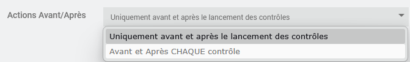

Ce paramètre définit si les actions Avant/Après sont lancées une seule fois (mode par défaut) ou pour chaque contrôle. Cette dernière option n'est valable que dans le mode Actions sur chaque contrôle indépendamment.

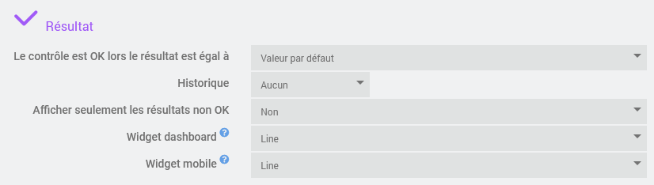

Le premier paramètre détermine dans quel cas le résultat est considéré comme correct. Cela permet d'afficher des icones significatives dans la tuile et le reporting. Noter qu'avec les conditions générées par le générateur d'expression, un résultat correct est représenté par False. Par défaut, les paramètres sont repris automatiquement de la configuration du plugin. 

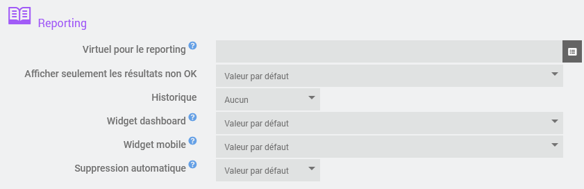

Cette section fournit le paramètrage pour l'enregistrement des résultat dans un virtuel (voir la section Widget). Par défaut, les paramètres sont repris automatiquement de la configuration du plugin. 

## Onglet Contrôles

Dans cet onlet sont définis les contrôles à effectuer et leur paramétrage.

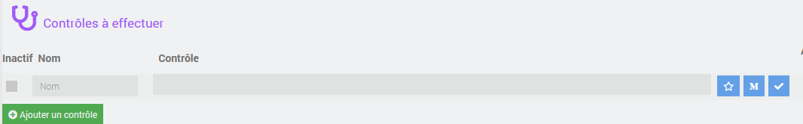

On ajoute les contrôles à effectuer. Ceux-ci sont exprimés de la même façon que dans la condition SI des scénarios. 

Les boutons à droite de l'expression permettent d'appeler le générateur d'expression, de transformer l'expression en macro ou d'appeler le testeur d'expression.

Les contrôles sont lancés en mode programmé (mode CRON), par la commande Refresh (en haut à droite de la tuile) ou lorsque l'on clique sur Sauver / Contrôler (dans ce dernier cas, les actions ne sont pas lancées).

Suivant le paramètrage du watchdog, le résultat des contrôles est affiché dans la tuile du watchdog et/ou dans le virtuel utilisé pour le reporting. Les résultats peuvent être utilisés partout dans Jeedom.

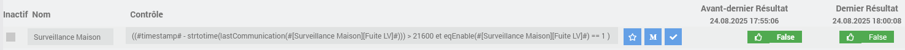

Le contrôle ci-dessus a été généré avec le générateur d'expression. La condition est évaluée en cliquant sur "Sauver / Contrôler". Le résultat est affiché. 

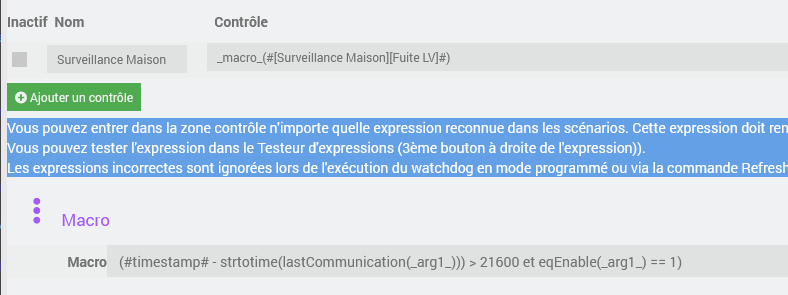

En cliquant sur le bouton Macro, une macro est générée et l'expression est modifiée pour utiliser la macro. Lorsque la macro est modifiée, il faut cliquer sur Sauver / contrôler pour qu'elle soit prise en compte dans les expressions.

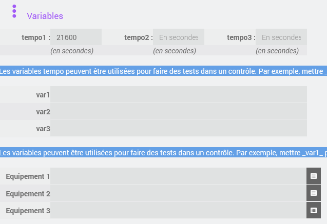

L'utilisation de variables permet des faire varier certains paramètres sans modifier l'expression ou la macro. Lorsqu'une variable est modifiée, il faut cliquer sur Sauver / contrôler pour qu'elle soit prise en compte dans les expressions.

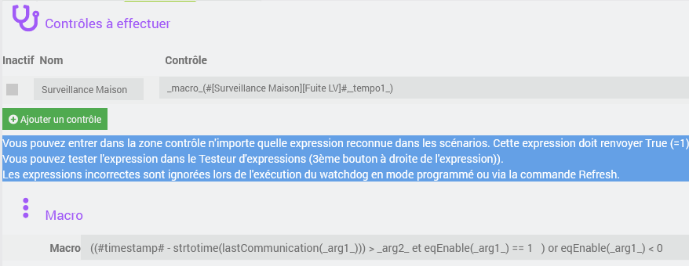

Ici, la macro a été modifiée pour pour passer le délai en paramètre et l'expression la variable tempo1 en deuxième argument.

Noter le test `eqEnable(_arg1_) < 0` qui permet de générer une condition True si l'équipement passé en paramètre a été supprimé.

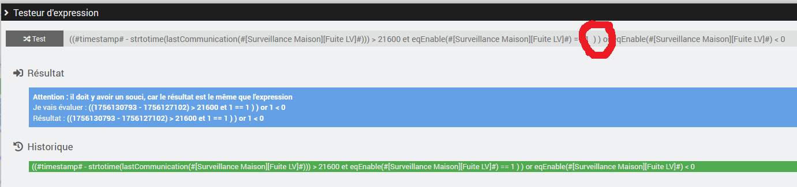

En cas d'erreur, il est possible d'appeler le testeur d'expression qui sera prérempli avec la condition. Ici, il y a une parenthèse fermante en trop.

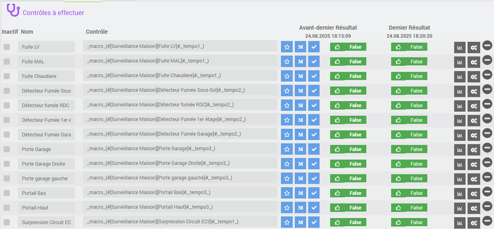

Une fois que l'on est satisfait de l'expression et de la macro, on peut l'appliquer à d'autres équipements. 

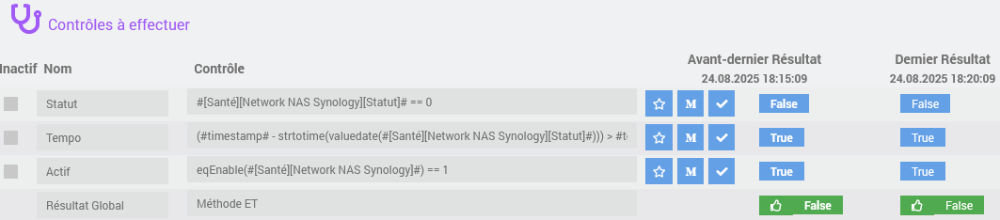

Dans le cas du mode de fonctionnement OU/ET, le résultat global des tests apparait comme dernière condition. C'est la valeur de cette condition qui va déterminer le lancement des actions.

## Onglet Actions

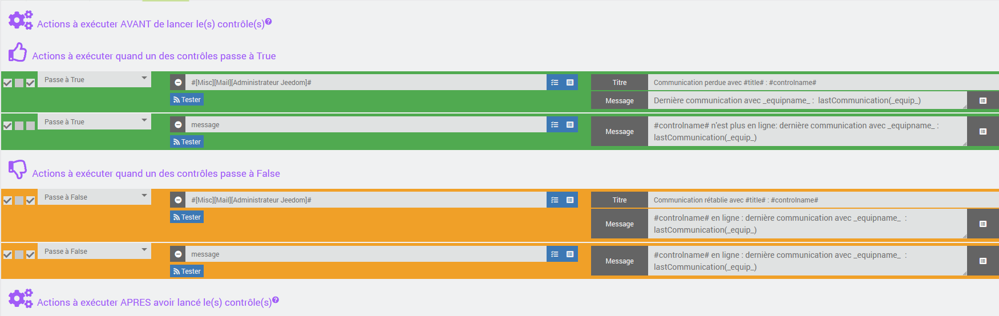

Il existe 4 sortes d'action.

*   Les actions qui sont lancées **AVANT** le contrôle 
*   Les actions qui sont lancées quand le contrôle passe à **TRUE**
*   Les actions qui sont lancées quand le contrôle passe à **FALSE**
*   Les actions qui sont lancées **APRES** le contrôle 

Les actions AVANT et APRES ne sont lancées qu'une seule fois, quelque soit le nombre de contrôles.

En mode Actions sur chaque contrôle indépendamment, chaque contrôle est effectué et si le contrôle a changé de valeur (ou si on a demandé de lancer les actions à chaque fois), les actions correspondant au nouvel état sont lancées. La même logique s'applique au résultat global en mode OU/ET.

Les actions peuvent être désactivées, testées et par défaut elles sont enregistrées dans la log watchdog_actions. Noter que les actions s'exécutent en mode séquentiel (à moins que l'on ait coché la case mode parallèle), ce qui fait que l'exécution d'une action peut bloquer le déroulement de l'ensemble des watchdogs.

Les actions se définissent de la même façon que dans les scénarios. Il est possible d'utiliser les variables dans les commandes, en particulier pour fournir des informations concernant la raison du problème. Toutes les variables définies dans l'onglet Contrôles sont utilisables.

En mode "Actions sur chaque contrôle indépendamment", la variable \_controlname\_ (ou #controlname#) indique quel est le contrôle à l'origine de l'action. de plus, les variables \_equip\_ (\_equipname\_ pour le nom) et \_cmd\_ (\_cmdname\_) sont fournies, elles indiquent le premier équipemnt / commande qui apparait dans l'expression de la condition à l'origine de l'action. Cela permet par exemple d'envoyer des messages plus précis sur l'origine de l'erreur. 

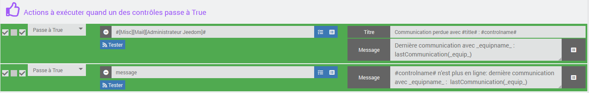

Dans l'exemple ci-dessus un mail et un message sont envoyés.

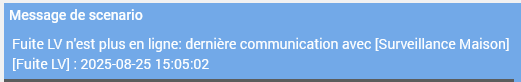

Le message utilise l'expression `_controlname_ n'est plus en ligne: dernière communication avec _equipname_ :  lastCommunication(_equip_)`.

# Widgets

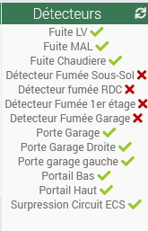

La tuile du watchdog permet de voir immédiatement l'état des équipements contrôlés. On peut choisir de voir l'état de tous les contrôles (valeur par défaut) ou seulement ceux en erreur.

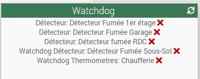

La tuile du virtuel utilisé pour le reporting permet de voir immédiatement l'état des équipements des watchdogs qui lui sont ratachés. On peut choisir de voir l'état de tous les contrôles  ou seulement ceux en erreur (valeur par défaut).

Dans les 2 cas, les templates sont repris des paramètres du watchdog. Si l'historique est activé, on peut le consulter en cliquant sur le contrôle.

# Exemples d’utilisation des Watchdogs 

## Contrôler les équipements du réseau local

Pour cet exemple, on va s’appuyer sur le plugin **Network**. Dans notre cas, il est configuré pour émettre un ping sur l'équipement concerné toutes les minutes.

Si l'équipement ne répond pas, la commande info [Statut] va passer à zéro.

Afin de ne pas générer d'alerte si on l'équipement est en cours de redémarrage, on testera que le statut est à zéro depuis au moins 5 minutes.

### Onglet Watchdog

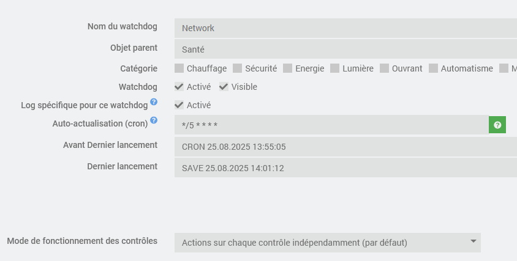

Dans cette configuration, le watchdog est lancé toutes les 5 minutes et le mode de fonctionnement est "Action sur chaque contrôle indépendamment".

### Onglet Contrôles

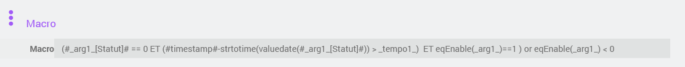

La macro est la suivante: `(#_arg1_[Statut]# == 0 ET (#timestamp#-strtotime(valuedate(#_arg1_[Statut]#)) > _tempo1_)  ET eqEnable(_arg1_)==1 ) or eqEnable(_arg1_) < 0`

Elle teste que le statut est à zéro depuis tempo1, que l'équipement Network est actif et défini.

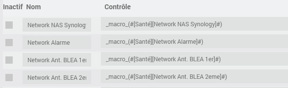

La macro est appliquée aux équipement à contrôler.

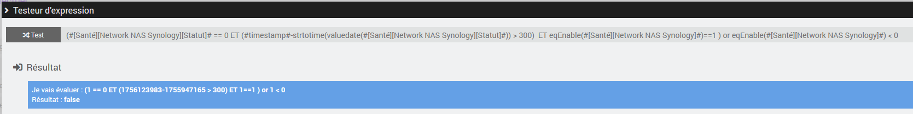

La condition générée peut être évaluée.

### Onglet Actions

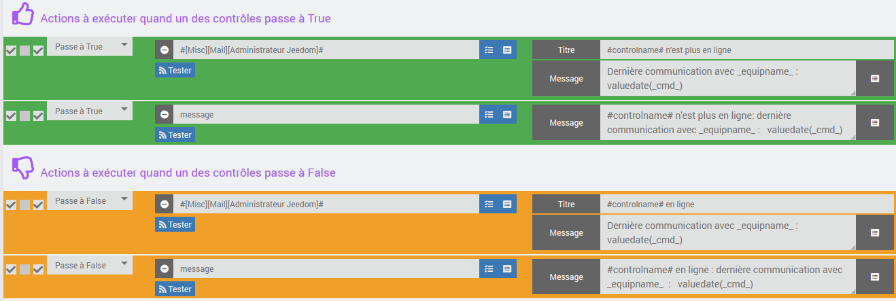

Un mail et un message sont envoyés lorsque l'on perd la connexion.

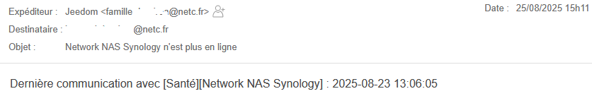

Expression de l'email: `Dernière communication avec _equipname_ :    valuedate(_cmd_)`

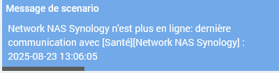

Expression du message : `#controlname# n'est plus en ligne: dernière communication avec _equipname_ :   valuedate(_cmd_)`

## Relancer le routeur Zigbee si il ne répond pas

Dans mon installation, il est arrivé que les routeurs Zigbee cessent de fonctionner (problème heureusement résolu depuis par un changement de firmware). Le seul moyen de les remettre en ligne était de les éteindre et de les redémarrer électriquement.

Pour traiter ce cas, j'ai branché les routeurs sur un switch Zigbee. Le but du watchdog ci-dessous est de lancer une commande de rafraichissement et de passer le switch en on/off si on perd la connexion. Un mail est envoyé (une seule fois) lorsque l'on constate la déconnexion.

### Onglet Watchdog

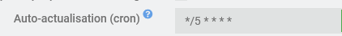

Le watchdog est lancé toutes les 5 minutes.

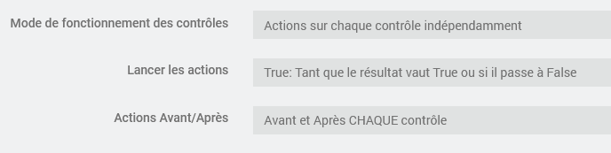

Les actions sont lancées sur chaque contrôle indépendamment.

Les actions correspondant à True sont lancées aussi longtemps que le contrôle est en erreur.

Les actions Avant sont lancées avant chaque contrôle.

### Onglet Contrôles

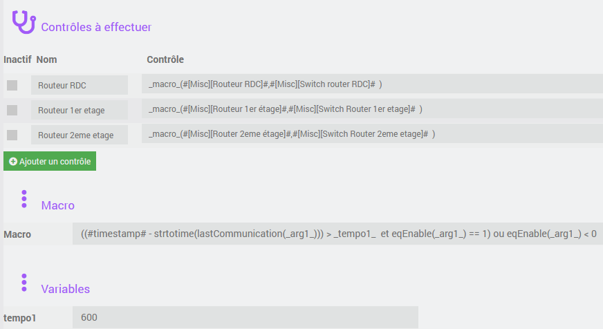

La macro est la suivante: `((#timestamp# - strtotime(lastCommunication(_arg1_))) > _tempo1_  et eqEnable(_arg1_) == 1) ou eqEnable(_arg1_) < 0`

Elle teste que la dernière communication date de moins de 10 minutes.

Les macros sont appliquées à 3 routeurs zigbee. Le deuxième argument indique quel est le switch sur lequel est connecté le routeur. Il n'est pas utilisé dans le contrôle mais servira dans les actions.

### Onglet Actions

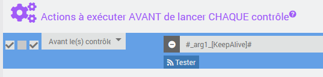

L'action avant est destinée à maintenir la communication avec le routeur. L'équipement correspondant est déterminé par la variable `_arg1_`.

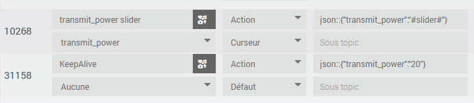

En standard, le routeur zigbee ne propose pas de commande permettant de le réveiller. Aussi une commande permettant de fixer le niveau d'émission a été détournée de son usage primaire. La commande KeepAlive force la communication avec le routeur. Elle est déclenchée à la même fréquence que le watchdog soit toutes les 5 minutes.

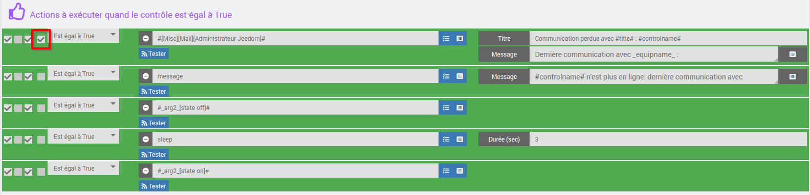

Le résultat du contrôle passe à True si il n'y a pas de communication depuis plus de 10 minutes (comme le routeur est réveillé toutes les 5 minutes, cela correspond à une anomalie).

Les actions permettent d'envoyer un mail et un message et de relancer le routeur en coupant et rétablissant son alimentation.

Noter la coche sur la l'envoi de mail qui permet d'envoyer le mail seulement une fois.

Quand la situation est rétablie, un mail et un message sont envoyés.

## Contrôler que les Nuts sont vivants

**CET EXEMPLE PROVIENT DE LA DOCUMENTATION INITIALE DU PLUGIN ET PEUT NE PAS ETRE EN PHASE AVEC LA VERSION ACTUELLE**

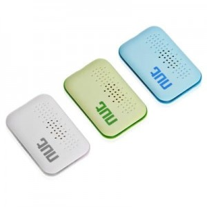

J’utilise les Nuts pour savoir si nous sommes à la maison ou pas.

4 Nuts :

*   1 Nut dans la boîte à gants de la voiture de Monsieur
*   1 Nut accroché aux clés de Monsieur
*   1 Nut dans la boîte à gants de la voiture de Madame
*   1 Nut accroché aux clés de Madame

L’idée est de vérifier que les nuts se sont manifestés dans les dernières 12h. A défaut, on peut imaginer qu’ils n’ont plus de pile.

### Onglet Watchdog

Dans cette configuration, je lance le contrôle toutes les 2h.

J’utilise ce mode de fonctionnement car je veux contrôler chaque Nut indépendamment et que le plugin Watchdog me signale lequel n’a pas répondu dans les dernières 12 heures.

### Onglet Contrôles

Ici, 4 nuts donc 4 équipements à surveiller donc 4 contrôles.

Pour l’exemple, j’ai utilisé les noms simples de Nut, à vous de personnaliser.

Le contrôle est **(#timestamp# – strtotime(collectdate(#\[Equipements internes\]\[Nut1\]\[Present\]#))) > #tempo1#**

On peut soit recopier ce contrôle soit utiliser l’assistant en cliquant sur la petit icone verte à côté du contrôle.

Ce contrôle va vérifier si la dernière fois que le Nut a donné signe de vie est inférieure à 12h soit 43200 secondes, il ne faut pas oublier de spécifier cela en tempo1 :

### Onglet Actions

J’ai choisi d’utiliser Pushover pour m’informer mais cela est adaptable par chacun.

J’utilise donc les commandes suivantes :

**Attention ! Dans l'illustration ci-dessus #name# doit être remplacé par #controlname#.**

Nota, on peut utiliser le nom du contrôle dans l’action : **#controlname#** = Nom du contrôle qui a déclenché l’action, on peut aussi utilise **#title#** = nom du Watchdog

## Contrôler que les capteurs XIAOMI sont actifs

**CET EXEMPLE PROVIENT DE LA DOCUMENTATION INITIALE DU PLUGIN ET PEUT NE PAS ETRE EN PHASE AVEC LA VERSION ACTUELLE**

J’utilise deux Gateway, des détecteurs d’ouverture, des détecteurs de présence, des détecteurs de vibration, des détecteurs d’eau, des capteurs température/hygro, des boutons…

Je propose de créer un Watchdog pour les équipements Xiaomi, la seule différence entre les uns et les autres réside dans la durée de la tempo qui contrôle que l’équipement est actif.

Le plugin Xiaomi à prévu la fonction « refresh » pour questionner l’équipement et rafraichir les valeurs. Il ne faut pas le lancer toutes les minutes sinon les piles ne finiront pas la semaine, mais pour ce type d’équipement (contrairement aux Nuts), il est utile de lancer un refresh avant de tester si l’équipement est actif.

Je ne lance un Refresh que sur les équipements qui peuvent ne pas avoir de mise à jour tout seuls. Par exemple, les fenetres peuvent rester fermées plusieurs jours alors que les capteurs de présence bougent tout le temps. Donc les capteurs de fenêtres feront l’objet d’un refresh pas les capteurs de présence.

### Onglet Watchdog

Dans cette configuration, je lance le contrôle toutes les 4h.

J’utilise ce mode de fonctionnement car je veux contrôler chaque Xiaomi indépendamment.

### Onglet Contrôles

Ici, (pour l’exemple) Deux Gateways, un capteur de fenêtre, un détecteur de présence :

Le contrôle est **(#timestamp# – strtotime(collectdate(#\[Etage\]\[Gateway Chambre\]\[Online\]#))) > #tempo1#**

On peut soit recopier ce contrôle soit utiliser l’assistant en cliquant sur la petit icone verte à côté du contrôle.

Ce contrôle va vérifier si la dernière fois que l’équipement a donné signe de vie est inférieure à 10min pour les Gateway et 12h pour les autres équipements, il ne faut pas oublier de spécifier cela en tempo1 et tempo2 :

### Onglet Actions

J’ai choisi d’utiliser Pushover pour m’informer mais cela est adaptable par chacun.

J’utilise donc les commandes suivantes :

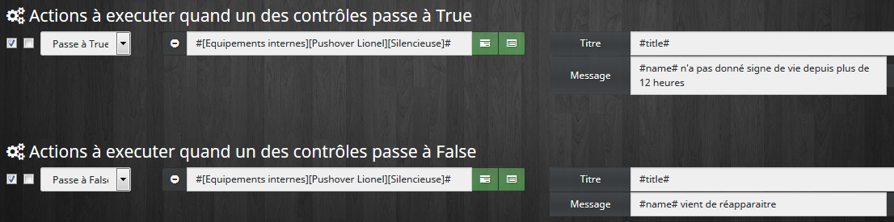

**Attention ! Dans l'illustration ci-dessus #name# doit être remplacé par #controlname#.**

Nota, on peut utiliser le nom du contrôle dans l’action : **#controlname#** = Nom du contrôle qui a déclenché l’action, on peut aussi utilise **#title#** = nom du Watchdog

Certains équipements qui doivent être rafraichis car leur état ne bouge pas forcement dans les 12 dernières heures (par exemple une fenetre ou un garage peut rester fermé). Pour cela, on peut lancer les commandes **Refresh** qui sont prévues pour actualiser l’état des équipements :

# Avis

**Si vous appréciez ce plugin, merci de laisser une évaluation et un commentaire sur le Jeedom market, ça fait toujours plaisir:** <https://jeedom.com/market/index.php?v=d&p=market_display&id=3716#>

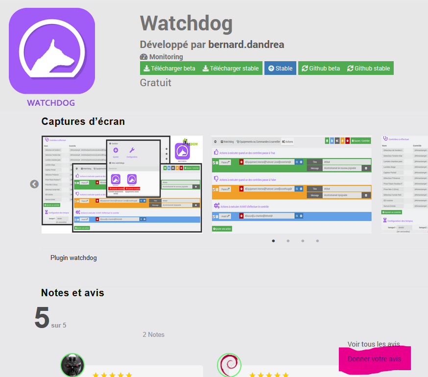