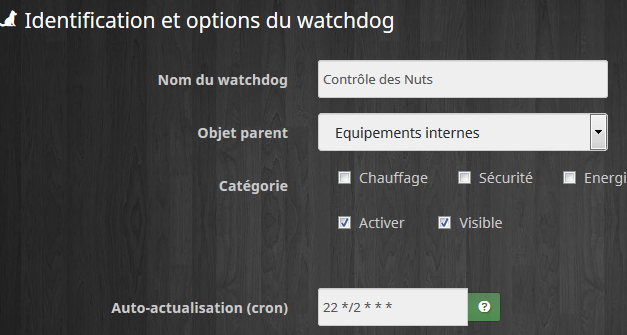

Ce plugin va vous permettre de surveiller vos équipements, exemples :

*   **Vérifier que vos nuts sont toujours actifs  
    **
*   **Contrôler que vos capteurs (quelque soit leur technologie) sont bien actifs**
*   **S’assurer que vos équipements réseau sont bien connectés au routeur**
*   **…**

En fonction des contrôles effectués (automatiquement), vous pouvez programmer des actions à effectuer, sur le modèle d’un scénario Jeedom.

# Installation du Plugin Watchdog

### Installer le Plugin depuis le Market

Aller ensuite dans le Market et sélectionner la version **stable** de **Watchdog**

Puis **Activer le plugin**

# Configurer chaque Watchdog

## _(Premier onglet : Watchdog)_

Nota : Il n’y a pas de paramètres globaux de configuration donc il n’est pas utile d’aller dans l’onglet configuration, chaque Watchdog a sa propre configuration et est géré independamment.

Voici les champs que vous pouvez trouver :

*   **Nom du watchdog**
*   **Objet parent**
*   **Catégorie**
*   **Activer**
*   **Visible**
*   **Auto-actualisation (cron)**

Ce champ correspond au rythme d’auto-actualisation, autrement dit CRON, par défaut ce champ vaut **\*/5 \* \* \* \*** ce qui veut dire toutes les 5 minutes, cliquez sur le point d’interrogation pour utiliser un autre rythme d’actualisation.

Pour aller plus loin sur les options des crons, je vous invite à parcourir [ce site](https://crontab.guru/#*_*_*_*_*)

*   **Dernier lancement**

C’est une information, ce champ n’est pas modifiable par l’utilisateur

*   **Mode de fonctionnement des contrôles**

Ce choix est important car il détermine comment va être calculé le moment où des actions doivent se lancer. Au départ, utiliser **Actions sur chaque contrôle indépendamment** c’est le mode le plus simple à comprendre, vous verrez plus tard pour utiliser les autres modes en fonction de vos besoins propres.

Les trois modes sont :

*   Actions sur chaque contrôle indépendamment : Ce mode teste indépendamment chaque contrôle et déclenche les actions quand ce contrôle a changé d’état
*   Actions sur l’ensemble des contrôles (avec méthode OU) : Ce mode teste le résultat global des contrôles en y appliquant un test « OU » entre chaque contrôle. Il déclenche les actions quand le résultat global a changé d’état.
*   Actions sur l’ensemble des contrôles (avec méthode ET) : Ce mode teste le résultat global des contrôles en y appliquant un test « ET » entre chaque contrôle. Il déclenche les actions quand le résultat global a changé d’état.

*   **Mode de fonctionnement des actions**

Ce choix est important car il détermine dans quel cas les actions sont déclenchées.

Les deux modes sont :

*   Lancer une action uniquement si le contrôle change de valeur : Ce mode vous prévient quand le contrôle effectué a changé d’état
*   Lancer une action à chaque controle en fonction du résultat : Ce mode execute à chaque contrôle l’action qui correspond au résultat du contrôle.

# Configurer les déclenchements

## _(Deuxième onglet : Equipements ou Commandes à surveiller)_

Cette onglet est divisé en deux parties :  

## Contrôles à effectuer

Dans cette partie, ajouter tous les contrôles que l’on souhaite. A chaque fois qu’un contrôle est ajouté, son résultat est affiché à droite dans la colonne Résultat. Si ce résultat n’est ni True ni False, c’est que ce contrôle est mal ortographié et il sera ignoré.

## Configuration des tempos

Les tempos sont des variables qui peuvent venir être utilisées dans le calcul des expressions. Regardez les exemples plus bas pour comprendre l’utilisation des tempos.

Pour les utiliser, il faut ajouter **#tempo1#** pour utiliser la valeur de la tempo1.

# Configurer les actions

## _(Troisième onglet : Actions)_

Il existe 3 sortes de commandes :

*   Les commandes qui seront lancées quant le contrôle passera à **TRUE**
*   Les commandes qui seront lancées quant le contrôle passera à **FALSE**
*   Les commandes qui seront lancées **AVANT** le contrôle (les commandes Refresh par exemple)

# Utilisation du log spécifique à chaque Watchdog

Pour pouvoir suivre les évenements de chaques Watchdog, un log spécifique a été créé.

Quand vous cliquez sur cet icone, vous verrez le log spécifique du Watchdog sur lequel vous êtes :

Pour sélectionner les actions qui seront inscrites dans le log, il faut cocher la 3ème case au début de chaque action :

Nota :A ce jour, seuls les infos « title » et « message » sont ajoutées dans ce log. Si vous avez besoin d’autres infos, n’hésitez pas à contacter **Sigalou**

## Utiliser une \[Résultat Global\] dans les scénarios

Chaque Wathdog peut avoir trois modes de fonctionnement, dans les modes qui évaluent des résultats globaux : Et et OU, il peut être intéressant de récupérer le résultat de ce test pour l’utiliser dans un scénario.

Une nouvelle commande info a été créée pour cela, elle se nome : \[Résultat Global\].

# Exemples d’utilisation des Watchdogs

## Contrôler que les Nuts sont vivants

J’utilise les Nuts pour savoir si nous sommes à la maison ou pas.

4 Nuts :

*   1 Nut dans la boîte à gants de la voiture de Monsieur
*   1 Nut accroché aux clés de Monsieur
*   1 Nut dans la boîte à gants de la voiture de Madame
*   1 Nut accroché aux clés de Madame

L’idée est de vérifier que les nuts se sont manifestés dans les dernières 12h. A défaut, on peut imaginer qu’ils n’ont plus de pile.

### Configuration du Watchdog :

Dans cette configuration, je lance le contrôle toutes les 2h.

J’utilise ce mode de fonctionnement car je veux contrôler chaque Nut indépendamment et que le plugin Watchdog me signale lequel n’a pas répondu dans les dernières 12 heures.

### Onglet Équipements à surveiller

Ici, 4 nuts donc 4 équipements à surveiller donc 4 contrôles.

Pour l’exemple, j’ai utilisé les noms simples de Nut, à vous de personnaliser.

Le contrôle est **(#timestamp# – strtotime(collectdate(#\[Equipements internes\]\[Nut1\]\[Present\]#))) > #tempo1#**

On peut soit recopier ce contrôle soit utiliser l’assistant en cliquant sur la petit icone verte à côté du contrôle.

Ce controle va vérifier si la dernière fois que le Nut a donné signe de vie est inférieure à 12h soit 43200 secondes, il ne faut pas oublier de spécifier cela en tempo1 :

### Onglet Commandes

J’ai choisi d’utiliser Pushover pour m’informer mais cela est adaptable par chacun.

J’utilise donc les commandes suivantes :

Nota, on peut utiliser le nom du contrôle dans l’action : **#controlname#** = Nom du contrôle qui a déclenché l’action, on peut aussi utilise **#title#** = nom du Watchdog

## Contrôler que les capteurs XIAOMI sont actifs

J’utilise deux Gateway, des détecteurs d’ouverture, des détecteurs de présence, des détecteurs de vibration, des détecteurs d’eau, des capteurs température/hygro, des boutons…

Je propose de créer un Watchdog pour les équipements Xiaomi, la seule différence entre les uns et les autres réside dans la durée de la tempo qui contrôle que l’équipement est actif.

Le plugin Xiaomi à prévu la fonction « refresh » pour questionner l’équipement et rafraichir les valeurs. Il ne faut pas le lancer toutes les minutes sinon les piles ne finiront pas la semaine, mais pour ce type d’équipement (contrairement aux Nuts), il est utile de lancer un refresh avant de tester si l’équipement est actif.

Je ne lance un Refresh que sur les équipements qui peuvent ne pas avoir de mise à jour tout seuls. Par exemple, les fenetres peuvent rester fermées plusieurs jours alors que les capteurs de présence bougent tout le temps. Donc les capteurs de fenêtres feront l’objet d’un refresh pas les capteurs de présence.

### Configuration du Watchdog :

Dans cette configuration, je lance le contrôle toutes les 4h.

J’utilise ce mode de fonctionnement car je veux contrôler chaque Xiaomi indépendamment.

### Onglet Équipements à surveiller

Ici, (pour l’exemple) Deux Gateway, un capteur de fenêtre, un détecteur de présence :

Le contrôle est **(#timestamp# – strtotime(collectdate(#\[Etage\]\[Gateway Chambre\]\[Online\]#))) > #tempo1#**

On peut soit recopier ce contrôle soit utiliser l’assistant en cliquant sur la petit icone verte à côté du contrôle.

Ce controle va vérifier si la dernière fois que l’équipement a donné signe de vie est inférieure à 10min pour les Gateway et 12h pour les autres équipements, il ne faut pas oublier de spécifier cela en tempo1 et tempo2 :

### Onglet Commandes

J’ai choisi d’utiliser Pushover pour m’informer mais cela est adaptable par chacun.

J’utilise donc les commandes suivantes :

Nota, on peut utiliser le nom du contrôle dans l’action : **#controlname#** = Nom du contrôle qui a déclenché l’action, on peut aussi utilise **#title#** = nom du Watchdog

Certains équipements qui doivent être rafraichis car leur état ne bouge pas forcement dans les 12 dernières heures (par exemple une fenetre ou un garage peut rester fermé). Pour cela, on peut lancer les commandes **Refresh** qui sont prévues pour actualiser l’état des équipements :

## Contrôler que les capteurs RFXCOM sont actifs

Les capteurs RFXCOM fonctionnent sur le même principe que les Nuts dans ce tuto, référez vous donc à la section des Nuts.

## Contrôler les équipements du réseau local

Pour cet exemple, on ne va pas réinventer l’eau chaude et on va s’appuyer sur le plugin **Network**.

Tous les équipements se ressemblent et on va aller tester la valeur Statut.

Si Value passe à **0** c’est que le ping n’a pas fonctionné.

### Configuration du Watchdog :

Dans cette configuration, je lance le contrôle toutes les minutes.

J’utilise se mode de fonctionnement car je veux contrôler chaque équipement indépendamment.

### Onglet Équipements à surveiller

Tous les équipements se configurent de la même manière puisqu’ils sont issus du plugin **Network**

Quand tout va bien ces lignes donneront True comme résultat, si un équipement ne ping plus, le plugin enverra 0 et donnera False.

Nota : les timers ne sont pas configurés dans cet exemple.

### Onglet Commandes

J’ai choisi d’utiliser Pushover pour m’informer mais cela est adaptable par chacun.

J’utilise donc les commandes suivantes :

